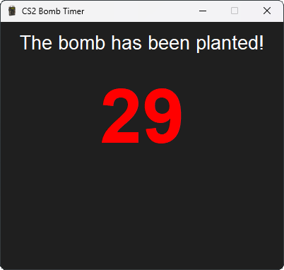

# CS2 Bomb Timer



Ever wanted an automatic countdown timer for CS2 bombs without having to keep track yourself? CS2 Bomb Timer has you covered! It’s a simple tool that detects when the bomb is planted, defused, or explodes—all by analyzing screenshots. Just launch and it’ll handle the rest.

## 🎉 Features
- **Automatic Detection**: Instantly detects bomb events—plant, defuse, and explosion.
- **Standalone**: Doesn’t mess with the game; it just takes temporary screenshots for visual cues.
- **Windows-Friendly**: Built for Windows but only tested on a 1920x1080 display.

## 📦 Installation

### Requirements
- **Python**: 3.6 or later (only tested with Python 3.12.1)
- **Python Libraries**:
  - `opencv-python`
  - `Pillow`
  - `tk`

### Setup Instructions

1. **Install Python and pip**.
2. **Run `Launch.bat`**:
   - This script checks if Python and pip are installed.
   - Automatically installs any needed libraries.

If you prefer to install things manually, you can do:
   ```bash
   pip install -r requirements.txt
```

### Notes on the Launcher
The `Launch.bat` file uses `pyw` to start `main.py`. If your system prefers `pythonw` or `pythonw3`, just edit `Launch.bat` and replace the two instances of `pyw` with the one that works for you.

## 🚀 Usage
Simply double-click `Launch.bat` to start the tool. It will automatically monitor for bomb events and count them down for you.

## ⚠️ Limitations
- **Resolution**: Only tested on 1920x1080.
- **Platform**: Windows only for now.
- **Monitors**: You need 2 monitors to be able to see the timer while ingame since it isn't an overlay. (Mini edition that overlays might get made on request)